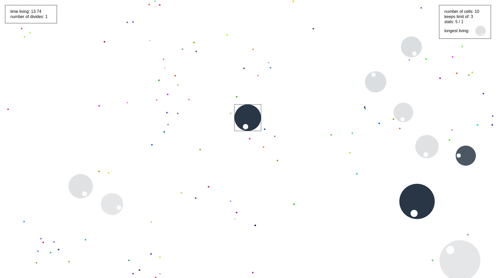

# Bally

A simple phisical engine inspired by [Marble Race](https://www.youtube.com/watch?v=1ldxrApreog).

Click anywhere to palce a ball. Now, i know, i hate phisics. Just run index.html to play. There is live demo avalible on [my website](https://okkindel.github.io/bally/). Have fun.

Click `C` to turn off collisions and `arrows` to modify gravity.

Yeah, I know it's _a bit_ buggy.

